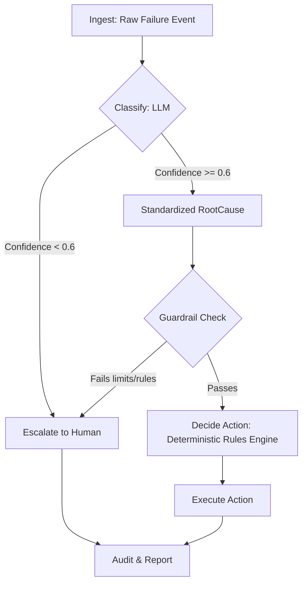

# Architecture of RecoverAI

RecoverAI explicitly separates AI generation from deterministic financial execution.

## System Flow

1. **Ingest**: The system pulls open payment failure events from `revenue_events`.
2. **Classify (LLM)**: A constrained LLM request (Zod schema) attempts to map the messy, raw failure reason to a standardized `RootCause`. It outputs confidence (0.0 to 1.0) and a human-readable reasoning string.
3. **Score & Gate**: If LLM confidence < 0.6, the event is escalated.
4. **Guardrail Check (Deterministic)**: Hard-coded logic verifies the event against max retry counts and an absolute amount ceiling (₹50,000).
5. **Decide Action (Deterministic)**: A pure function maps `(rootCause, amount, retryCount, stage)` -> `ActionType`. (See `decision-rules.ts`).
6. **Execute (Simulated)**: A mock execution runs, mimicking network latency and returning probabilistic success/failure.
7. **Audit & Report**: All reasoning, executed actions, and evaluated guardrails are logged immutably to `recovery_actions`.

## The Boundary
- **LLM**: ONLY parses raw strings into standardized categories. It never touches money.
- **Rules Engine**: Owns all money-touching actions. It cannot be bypassed.
